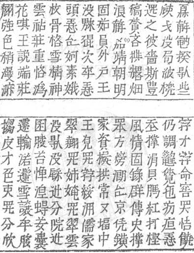

# OCR System for archiving scanned Han-Nom documents (image to text)

Example input:



Example output:

> 𤾓𢆥𥪞揆𠊛些<br />
> 𡦂才𡦂命窖𱺵恄饒<br />
> 𣦆戈没局𣷭橷<br />
> 仍調𬖉𧡊㐌𤴬疸𢚸<br />
> 𨔍之彼嗇斯豊<br />
> 𡗶撑涓貝𦟐紅打㭴<br />
> 稿𦹳吝𱠎𠓀畑<br />
> 風情固錄群傳史撑<br />
> 浪𢆥󰞸靖朝明<br />
> 𦊚方𪹚𣼽𠄩京凭鐄<br />
> 固茹員外户王<br />
> 家資擬拱常常堛中<br />
> 没𤳆𡥵次卒𢚸<br />
> 王󰞹𱺵𡦂綏𣳔儒家<br />
> 頭𢚸𠄩妸素娥<br />
> 翠翹𱺵姉㛪𱺵翠雲<br />
> 枚骨格雪精神<br />
> 没𠊛没𨤔𨑮分院𨑮<br />
> 雲󰏙莊重恪潙<br />
> 囷𦝄苔惮󰞺𧍋𦬑囊<br />
> 花唭玉説端莊<br />
> 𩄲輸渃𩯀雪讓牟䏧<br />
> 翹強色稍漫𣻕<br />
> 搊皮才色吏𱺵分欣

Difficulties:

- Scattered data.
- Needs data cleaning.
- Computationally-expensive model training.
- Complex AI pipeline.
- (Potentially) complex deployment.

Prototype goal:

- Architecture:
  ```text
  FE Web Interface
         |
    RESTful API
         |
   Backend Server
         |
    OCR Pipeline
  ```
- Activity Flow:
  `Image --> FE Web Interface Upload Form --> API --> Backend --> OCR Pipeline --> Text Output --> Backend --> API --> FE Web Interface Display`

---


## OCR Pipeline Architecture

Simplified Pipeline:

```text
Input --> Preprocessing -> ROI Detection -> Feature Extraction -> Character Recognition/Classification -> Output
 (I)           (1)              (2)                (3)                             (4)                     (O)
```

**Note:** Do **_NOT_** build everything from scratch. Only (3) needs major effort for building/training.

Pipeline Idea:

1. OpenCV (In-house)
2. EAST ((Efficient and Accurate Scene Text Detector))[https://paperswithcode.com/paper/east-an-efficient-and-accurate-scene-text]
3. CRNN (In-house)
4. CNN (In-house)


## Read more:

- (EAST)[https://paperswithcode.com/paper/east-an-efficient-and-accurate-scene-text]
- (EasyOCR)[https://paperswithcode.com/paper/east-an-efficient-and-accurate-scene-text]
- (Tesseract Open Source OCR Engine)[https://github.com/tesseract-ocr/tesseract]

